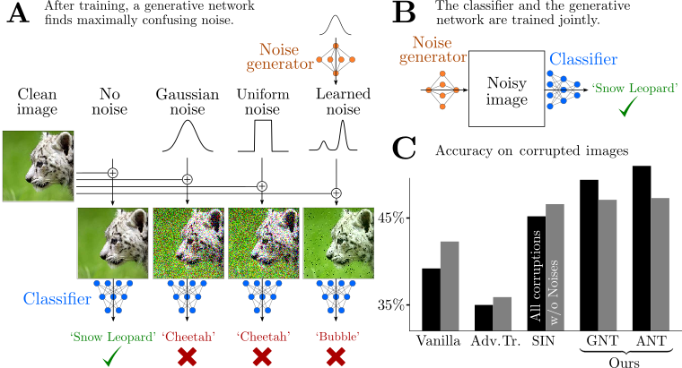

# Increasing the robustness of DNNs against imagecorruptions by playing the Game of Noise

This repository contains trained model weights and evaluation code for the paper [Increasing the robustness of DNNs against image corruptions by playing the Game of Noise](https://arxiv.org/abs/2001.06057) by Evgenia Rusak*, Lukas Schott*, Roland Zimmermann*, Julian Bitterwolf, Oliver Bringmann, Matthias Bethge & Wieland Brendel.

Our core message is that a very simple approach -- data augmentation with Gaussian noise -- suffices to surpass almost all much more sophisticated state-of-art methods to increase robustness towards common corruptions. Going one step further, we learn the per-pixel distribution to sample noise from adversarially with a simple generative neural network which we call the Noise Generator. Training the Noise Generator and the classifier jointly further increases robustness.




## Download models

Download the trained model weights by either running

```
bash ./Models/download_models.sh
```

or by downloading them from the [Releases on GitHub](https://github.com/EvgeniaAR/game-of-noise/releases).

## Evaluate models

To validate our models, run `python3 main.py`. It is necessary to download the model weights first!

Arguments:
 - `--datadir-clean` the top-level directory of the ImageNet dataset (mandatory)
 - `--imagenetc-path` the top-level directory of the ImageNet-C dataset (mandatory)
 - `--model_name` name of the model that should be evaluated (optional, default: `clean`, possible choices: `clean`, `ANT-SIN`, `ANT`, `Gauss_mult`, `Gauss_sigma_0.5`, `Speckle`)
 - `--workers` number of data loading workers (optional, default: 30)
 - `--test-batch-size` number of images in the batch (optional, default: 256) 

The results are saved as txt files.

## Example Usage

### Evaluate our model trained with Speckle noise data augmentation

It is necessary to specify the paths for the ImageNet validation dataset and the ImageNet-C dataset. Then you can run:
```
python3 main.py --model_name Speckle --datadir-clean /path-to-imagenet-val --imagenetc-path /path-to-imagenet-c
```

### Evaluate our best performing model trained with Adversarial Noise Training and on Stylized ImageNet

```
python3 main.py --model_name ANT-SIN --datadir-clean /path-to-imagenet-val --imagenetc-path /path-to-imagenet-c
```

## Results

The evaluation results are summarized in the Table below.

| Model           | ImageNet val top1 accuracy [%] ↗ | ImageNet-c top1 accuracy [%] ↗ |  ImageNet-C mCE ↘ |
| --------------- |:--------------------------------:|:------------------------------:|:-----------------:|
| Vanilla         | 76.1                             | 39.2                           | 76.7              |
| Speckle         | 75.8                             | 46.4                           | 68.3              |
| Gauss_sigma_0.5 | 75.9                             | 49.4                           | 64.0              |
| Gauss_mult      | 76.1                             | 49.2                           | 65.0              |
| ANT             | 76.1                             | 51.1                           | 62.5              |
| ANT-SIN         | 74.9                             | 52.2                           | 61.2              |
